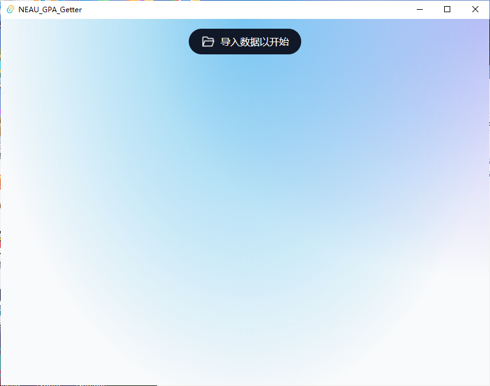
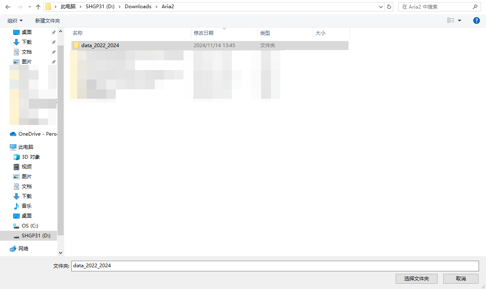
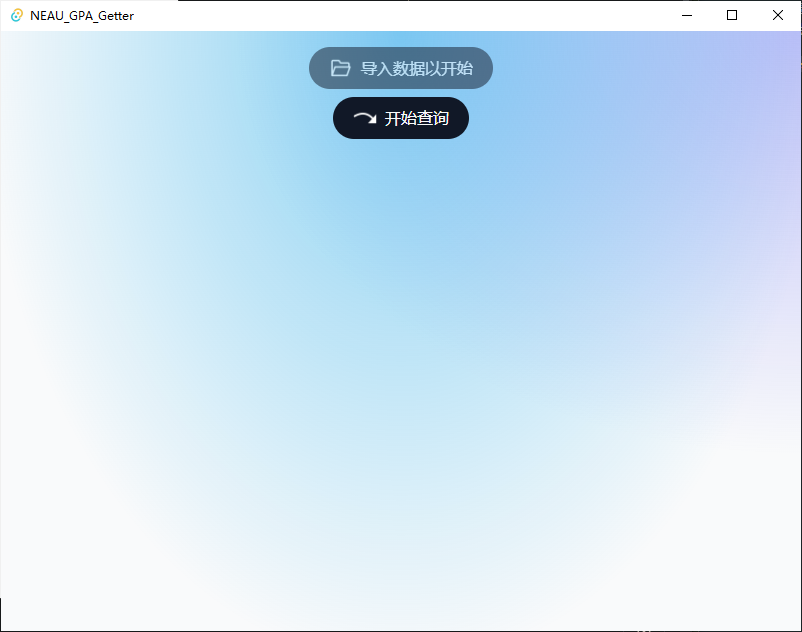
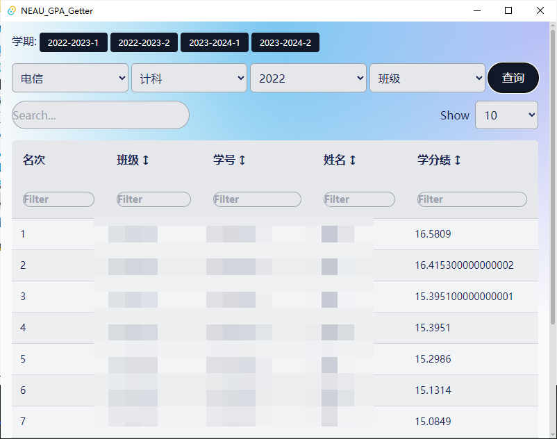

# NEAU-GPA-Getter
用于查询绩点排名信息的一个桌面客户端,适用于NEAU本科生。

基于[SvelteKit](https://kit.svelte.dev/)与[Tauri](https://tauri.app/)编写，支持Windows操作系统。
## Features
- 通过导入csv文件,建立绩点信息相关的数据库
- 支持按照学期、专业、班级查看绩点排名信息
- 支持对查询结果进行搜索、排序
## Install
请到发布页面下载对应的安装程序：[Release Page](https://github.com/LaixiLiu/NEAU-GPA-Getter/releases)。
## Usage
1. 安装应用程序;
2. 在[发布页面](https://github.com/LaixiLiu/NEAU-GPA-Getter/releases)下载数据文件(名称为`data_yyyy_yyyy.zip`);
3. 将数据文件解压到某一目录中,假设目录名称为`data_2022_2024`;
4. 打开应用程序，点击`导入数据以开始`按钮
   
   1. 在弹出的窗口对话中选择`data_2022_2024`目录并确定
        
   2. 等待1~2分钟后，数据导入完毕,若导入成功则可点击`开始查询`按钮进入查询界面
        
   3. 选择所要查询的学期、学院、专业、年级信息后，点击`查询`按钮,即可查看结果
        

### Notice
- 查询成绩信息时，除`班级`选项外，其余选项均需选择。
- `学期`可单选或者多选
    - 当选中多个`学期`时,`专业`必须选择为最后一个学期你所在的专业。

        例如：小刘是一名22级的学生，他大一上是在A学院的a专业学习，然后转专业至B学院的b专业学习，现在要查询大一两学期的总绩点排名(此处指在b专业22级学生中的排名),则需要选择如下选项：
        
        - 学期：2022-2023-1, 2022-2023-2（大一上下学期）
        - 学院: B学院
        - 专业: b专业
        - 年级: 2022(即入学年份)
        - 班级：可不选(若选择班级，则结果为班级排名，而非专业排名)
- `专业`信息根据教务处发布的学分绩公示文件生成,若有大类招生，大二进行专业分流的学生，在查询时若选中了分流后的学期，需要将专业选择为分流后的专业(如：计科类->计科)

## License
本项目采用双许可证协议，您可以选择 [Apache License, Version 2.0](LICENSE-APACHE) 或 [MIT license](LICENSE-MIT)。